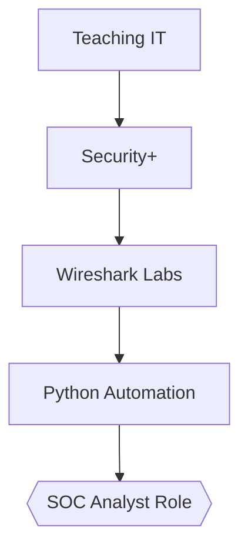

# Rene Tejon | Cybersecurity Transition Portfolio
`Security+ | Python | SOC Analysis | GRC`  
*(Adjunct Professor → SOC/GRC Analyst)*

## 🚀 Current Focus (Week of July 28)
- [ ] Wireshark: Analyze [sample C2 traffic](https://www.malware-traffic-analysis.net/2023/11/17/index.html)
- [ ] Python: Build basic log parser (I'll provide dataset)
- [ ] Applications: 5 SOC I roles (FL govt/education)

 

## 🔬 Featured Labs
| Lab                                 | Tools     | Status           | Skills Demonstrated |
|-------------------------------------|-----------|------------------|---------------------|
| [Wireshark Basics](labs/wireshark/) | Wireshark | 🚧 In Progress  | Packet Analysis     |
| [Python Fundamentals](scripts/)     | Pandas    | 🚧 Learning     | Data Parsing        |

## 🌱 Learning Journey

## 📬 Contact
Let's discuss security roles or collaborate:  
✉️ **Email**: rjtejon@gmail.com  
💼 **LinkedIn**: [linkedin.com/in/rene-tejon](https://linkedin.com/in/rene-tejon)  
🔐 **Credly**: [credly.com/users/rene-tejon](https://www.credly.com/users/rene-tejon/badges)  

---
> *"Transitioning knowledge into protection – one lab at a time."*
